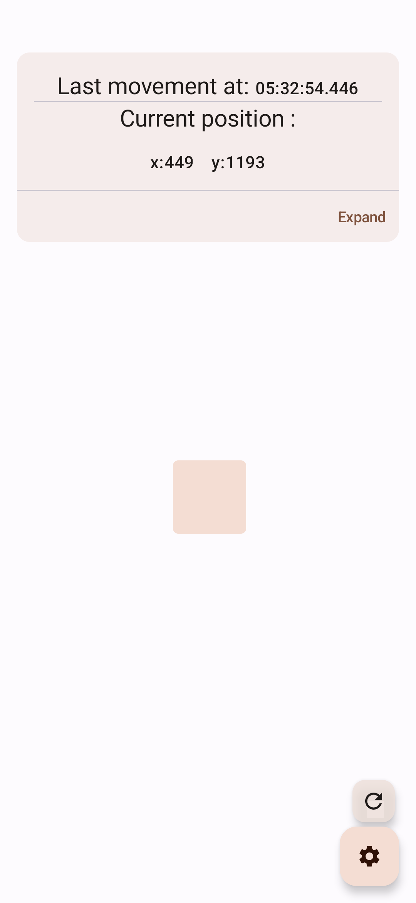
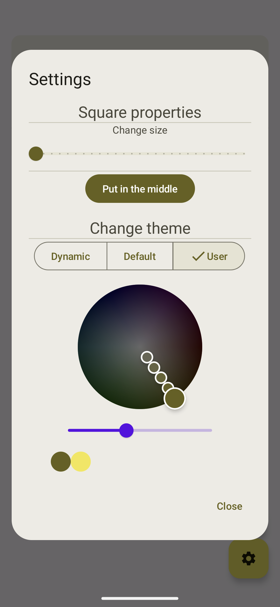
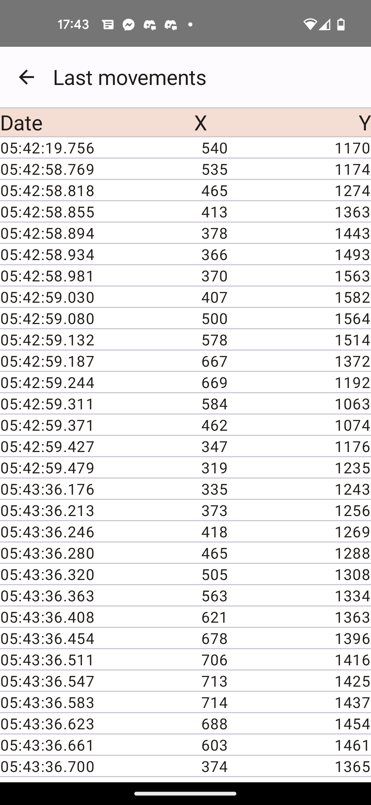

# Square Position History

The purpose of this app is to record the position at time of a square draggable with finger.
It contains:
- A screen that able the user to move the square and print the current position
- A settings dialog that allow the user to tweak the square and the app theme
- A screen that able to visualize history

# Implementation
The app ui layer is based on Jetpack Compose
## Architecture
The implementation tries to follow as much as possible the clean architecture principles.

```
app/src/main/java/com/interview/square
├── core
│   ├── data
│   │   ├── repository
│   │   └── service
│   ├── domain
│   │   ├── model
│   │   ├── repository
│   │   └── service
│   └── ui
│       └── theme
├── di
├── extensions
├── feature_position_history
│   ├── data
│   ├── domain
│   └── ui
├── feature_square_move
│   └── ui
└── screens
```
At the root we can find:
- `core` package that holds common code for the whole application
- `di` package that contains koin module
- `extensions` is an helper package for kotlin extensions
- `feature_*` packages separe the different features of the app, here a feature is consider as a screen
- `screens` contains the sealed class helper for the navigation

Inside core and features packages, we got the 3 clean architecture layers:
- `domain` package holds the models and all the interfaces, free as much as possible of the platform specific class and code 
- `data` contains a concrete implementation of the domain layer
- `ui` contains all components that are relative to the ui

## Main Libraries
- Compose - for ui layer
- Koin - for dependency injection

# Improvement 
Possible improvement:
- Relocate and reorganize all the mappers, they should not be inside domain layer
- Create libraries to improve the modularity of the app
- Improve current position display 
- Inject ThemeManager
- Make home screen floating elements like PositionHistoryCard and floating buttons move when the square is on them 

# Screenshots
  
